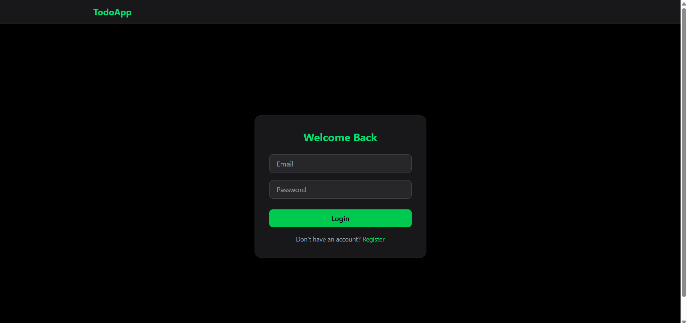
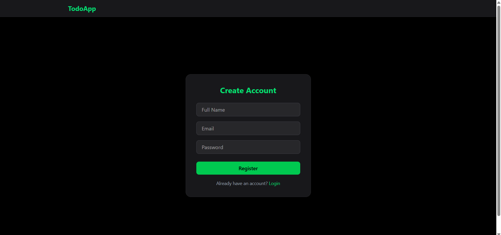
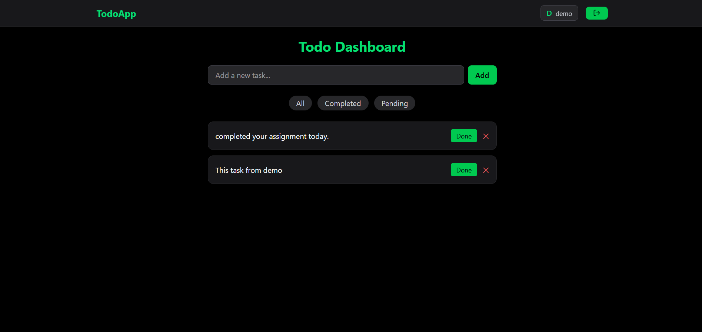

# 📝 MERN Todo App

A full-stack Todo application built with the MERN stack (MongoDB, Express, React, Node.js) with authentication and task management.

---

## 🚀 Live Demo

🌐 Frontend: https://todo-mern-five-gilt.vercel.app/  
🔗 Backend API: https://todo-backend-avt4.onrender.com/  

⚠️ Note: Backend is hosted on Render free tier, so first request may take 50–60 seconds.

---

## ✨ Features

- 🔐 User Authentication (JWT + Cookies)
- 📝 Add, Update, Delete Todos
- ✅ Mark task as completed / pending
- 🔍 Filter (All / Completed / Pending)
- 🎨 Responsive UI (Tailwind CSS)
- ⚡ Toast Notifications

---

## 🖼️ Screenshots

### 🔐 Login Page


### 📝 Register Page


### 📊 Dashboard


---

## 🛠️ Tech Stack

**Frontend**
- React.js
- Redux Toolkit
- Tailwind CSS
- Axios

**Backend**
- Node.js
- Express.js
- MongoDB (Mongoose)
- JWT Authentication

---

## ⚙️ Installation

### 1️⃣ Clone the repository

```bash
git clone https://github.com/Patelmeet453/Todo-Mern.git
cd todo-mern